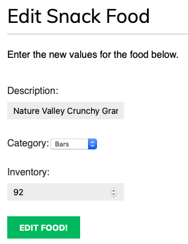

# School Lunch Management System - SLMS
*The School Lunch Management System (SLMS)* is a web application that intends to help elementary schools efficiently participate in their county's school lunch program.
## Goals and Overview
* The elementary school requires their students to choose a lunch type for each day that they are attending:
  * *hot lunch* (served by the cafeteria)
    * Also required to select *parent attendance* with this lunch type 
  * *cold lunch* (brought with them from home)
  * *field trip lunch* (on days they are participating in a field trip and would like a lunch provided)
* Students can reference the county's lunch calendar (link on the school website) to reference upcoming lunch details.
* The school tracks lunch selections to ensure lunches prepared and space available is adequate.  
* Teachers track student selections as needed. 
* Snacks are distributed during school days by staff who can:
  * Create new *snack counts* detailing the distribution.
  * Add new *snack foods* available for distribution.
* Users may follow other users to be notified of their lunch selections.
## Navigation and Use
The information below provides new users to the SLMS system with direction on how to get started.
### New User Registration and Log in
New users to the system can register for an account by clicking the *Register here* link where they'll be asked to create an account as shown below.

Once registered, users can enter their username and password and then press the Log-in button to enter SLMS via the Log-in screen:
  

Users also have the option to indicate that they've forgotten their password by clicking the *Forgot password?* link.  They'll be asked to enter the email used when registering their account so that a password reset email may be sent to them.  

### User Dashboard
Once a user is logged into SLMS, they are greeted by the User Dashboard screen where they'll be able to see the activity of the users they've chosen to follow:

From here, users can select the *edit your profile* link to edit their account details: 

Users can also select the *change your password* link to change their current account password.

### Lunch Selections
Student users can create a lunch selection for the day by first clicking on *Selections* in the top navigation bar where they'll be presented with the view of recent selections that have been made by SLMS users.  They can then *TODO: Update this action:* click on the *create a new selection* link where they can fill in the details and publish their selection by selecting the *Make Selection* button.

### People
Users may view the listing of SLMS users by selecting the *People* link in the top navigation bar.  They may then click on a user to see their follower count, as well as their recent activity.  They can follow that user by clicking the *Follow* button.

### Snack Dashboard
When a **Staff User** is logged into SLMS, they are presented with a slightly different navigation bar indicating that they also have a *Snack Dashboard* navigation option.

By clicking on the *Snack Dashboard* link, a user is presented with the view of recent snack counts that have been made by staff along with links to *create a new snack count* and to *view available snack foods*.

Clicking on a snack count takes the user to the count's details, and clicking the *Edit* link for a snack count allows the user to edit the count's details (if they are the user who created the count).

By selecting the *create a new snack count* link, a user is presented with the snack count form where they can fill in the details and create the snack count by pressing the *Create Count* button.

By selecting the *view available snack foods* link, a user is presented with the *Snack Food Dashboard* where they can view the listing of snack foods.

Clicking on a food takes the user to the food details.

Clicking the *Edit* link on a snack food allows the user to edit the food's details.

### Log out
Users can log out of SLMS at any time by selecting the *Logout* link in the top right section of the navigation bar.

## Configuration:
* Python / Django version
* Any dependencies
* Related configuration
* Deployment instructions
